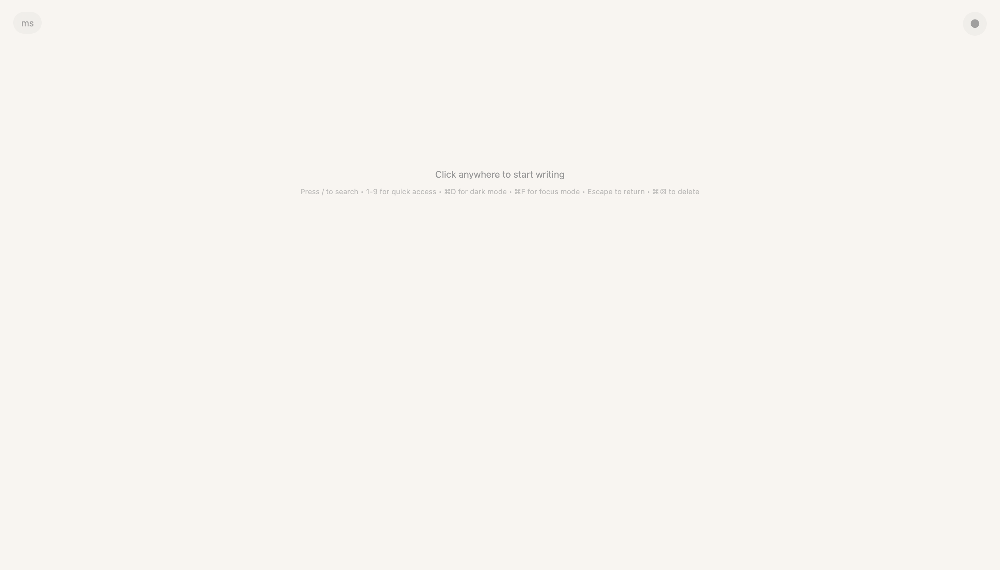
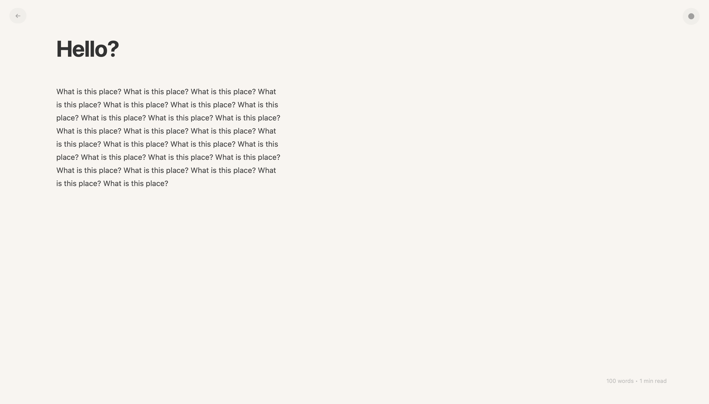
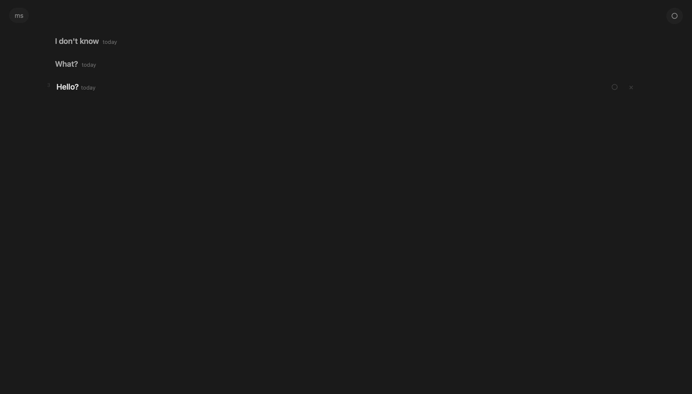
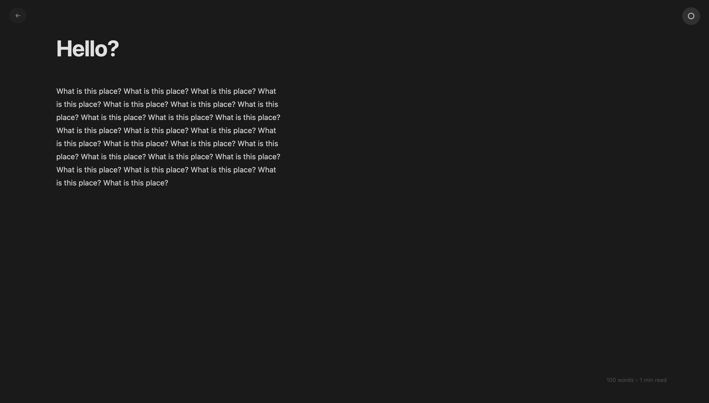
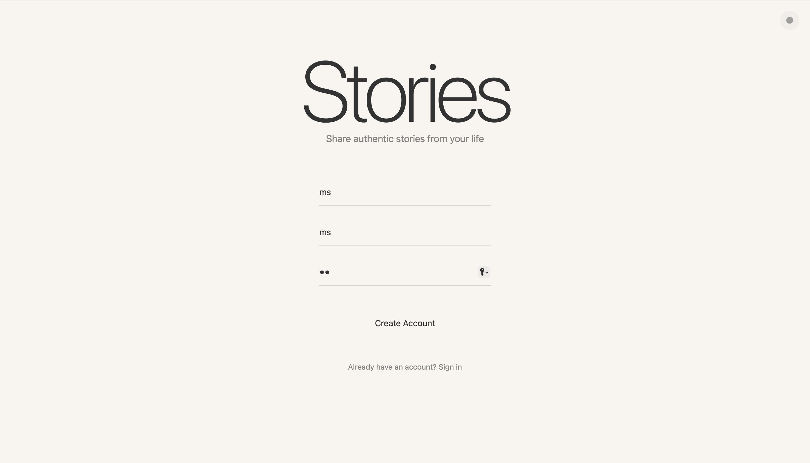

# Stories — still in dev

**A minimal place to write**

A clean, fast writing surface with just the essentials.

---

## Write

Clean, distraction-free writing. No clutter, just words.

### Simple Start

Create an account and start writing immediately. Click anywhere to begin your first story.

### Focus on Writing  

Distraction-free interface with smart text editing, word count, and focus mode for uninterrupted creativity.

### Organise Stories

Keep all your stories in one place with quick navigation, search functionality, and easy publishing controls.

The header includes a Home button for a quick return to your writing.

### Dark Mode

Eye-friendly dark mode for comfortable writing in any lighting. Toggle with ⌘D anytime.

### Private by default

Your drafts stay private. Publish only when you want.

Manage your profile: edit name and bio, view stats, change password, export data, or delete your account.

---

## Technical Features

### Writing Experience
- **Clean, distraction-free interface** - Click anywhere to start writing
- **Smart text editing** - Auto-formatting for quotes, dashes, lists, and indentation
- **Focus mode** - UI controls fade during active writing (⌘F to toggle)
- **Word count & reading time** - Real-time feedback on your progress
- **Dark mode** - Eye-friendly writing in low light (⌘D to toggle)

### User Management
- **Secure accounts** - Email/password authentication with user-specific data
- **Personal library** - All your stories are private by default
- **Quick access** - Use number keys (1-9) for instant navigation to recent stories
- **Home button** - Jump back to your stories from anywhere

### Optional publishing
- **Publish (○/◉)** - Share when you’re ready
- **Views** - Simple reader counts
- **Reader view** - Clean, focused display
- **Browse** - See published writing by all users

### Profile & Account
- **Profile** - Update name and bio, see your stats (stories, published, views, words)
- **Account actions** - Change password, export data, or delete your account

---

## Keyboard Shortcuts
- **⌘D** - Toggle dark mode
- **⌘F** - Toggle focus mode (writing only)
- **⌘⌫** - Delete current story
- **/** - Search your stories
- **1-9** - Quick access to recent stories
- **Escape** - Return to main page
 
Tip: Click your name (top-left) to open the menu (Home, Browse, Profile, Sign Out).

## Getting Started

1. **Open the app** in your browser
2. **Create an account** with your email and name
3. **Click anywhere** to start writing your first story
4. Optional: **Publish** (○) when ready
5. **Go Home** to your library or **Browse** published writing

## Technical Details

- **Pure HTML, CSS, and JavaScript** - No frameworks needed
- **No external dependencies** - Everything self-contained
- **LocalStorage data** - Stories saved in browser locally
- **Works completely offline** after first load

---

## Built for writing

Fast to open, simple to use, and focused on the words.

**[Live Demo](https://mohummudh.github.io/stories/)**

---

*Stories • A minimal place to write*
